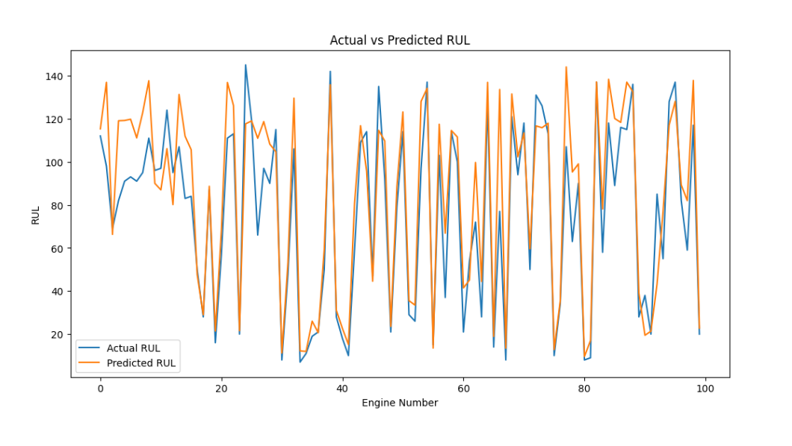
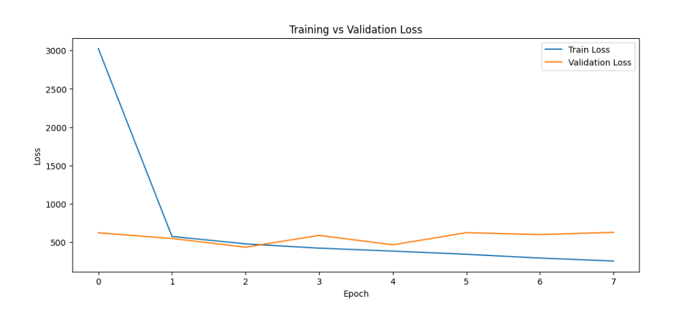

# NASA CMAPSS Jet Engine RUL Prediction: From Baseline to Deep Learning Optimization

## 📌 Project Overview
This project focuses on **Predictive Maintenance (PdM)** using the benchmark **NASA CMAPSS (FD001)** dataset. The core objective is to accurately predict the **Remaining Useful Life (RUL)** of 100 turbofan engines based on time-series sensor degradation data. 

Instead of deploying a single out-of-the-box model, this project represents a **3-stage iterative engineering journey**. Through rigorous feature filtering, hyperparameter fine-tuning, threshold optimization, and transitioning to **Deep Learning (LSTM)**, the prediction error (**RMSE**) was successfully cut by **47.3%** compared to the baseline.

---

## 📈 The Optimization Journey & Results Summary

| Phase | Model Architecture | Scaling Method | Key Engineering Strategy | Test RMSE | Test MAE |
| :--- | :--- | :--- | :--- | :---: | :---: |
| **V1.0** | Random Forest (Baseline) | MinMaxScaler | Raw Calculated RUL Target | 33.60 | - |
| **V2.0** | Random Forest (Optimized) | RobustScaler | Target Clipping Optimization (**RUL <= 153**) | 17.84 | 13.09 |
| **V3.0** | **Deep Learning (2x LSTM)** | StandardScaler | Time-Step Sequences (**Window Size = 30**) | **16.80** | **12.35** |

---

## 🛠️ Detailed Engineering Phases

### 🔹 Version 1.0: Establishing the Baseline
* **Objective:** Establish the initial pipeline and structure the target data.
* **Feature Engineering:** Programmatically identified and dropped 7 constant/invariant columns (`op_setting_3`, `sensor_1`, `sensor_5`, `sensor_10`, `sensor_16`, `sensor_18`, `sensor_19`) that added noise without predictive value.
* **Target Setup:** Calculated the true RUL for the training set by determining the maximum life cycle per engine unit and subtracting the current time cycle.
* **Outcome:** The initial Random Forest model (400 estimators, max depth 20) yielded an **RMSE of 33.60**, indicating a strong need for degradation-specific tuning.

### 🔹 Version 2.0: Fine-Tuning & RUL Threshold Optimization (The Turning Point)
* **Objective:** Improve model stability near initial engine life cycles where sensor degradation hasn't visibly started.
* **The Strategy:** Conducted a rigorous sweeping experiment across multiple RUL ceiling thresholds (`152, 153, 154, 155`). Evaluated the impact of each threshold on data size and prediction accuracy, specifically analyzing error rates on "hard engines" (Actual RUL < 50).
* **Key Discovery:** Capping the maximum target RUL at **153 cycles** combined with **RobustScaler** proved to be the absolute optimal sweet spot.
* **Outcome:** Slashed the RMSE down to **17.84** (a 47% improvement), while maintaining a remarkably low RMSE of **15.08** for engines nearing critical failure points (< 50 cycles remaining).
* **Results Visualization:**

.png)
_Region.png)

### 🔹 Version 3.0: Transitioning to Deep Learning (LSTM Recurrent Neural Networks)
* **Objective:** Capture the temporal, cumulative sequence of sensor degradation rather than treating cycles as independent tabular rows.
* **Data Transformation:** Engineered a temporal 3D array using a **sliding window of 30 time-steps** (`X_train shape: 17631, 30, 17`). For the test phase, extracted the exact last 30 operational cycles per engine to feed into the sequential network.
* **Architecture:** Built a multi-layered Recurrent Neural Network using **TensorFlow/Keras**:
  * `LSTM (64 units, return sequences=True)` + `Dropout(0.3)`
  * `LSTM (32 units)` + `Dropout(0.4)`
  * `Dense (64, ReLU)` -> `Dense (32, ReLU)` -> `Dense (1, Linear Output)`
* **Training Dynamics:** Implemented `EarlyStopping` (patience=5 monitoring validation loss) to prevent overfitting.
* **Outcome:** Achieved a highly robust Deep Learning **RMSE of 16.80**, proving the model's ability to extract automated temporal features from complex physical sensor arrays.
* **Results Visualization:**

---

## 🧠 What this Project Demonstrates to Recruiters

1. **Analytical Mindset:** I don't just fit models; I run controlled empirical experiments to locate the optimal global thresholds that balance data volume against model accuracy.
2. **Domain-Specific Logic:** Understanding that mechanical degradation is non-linear and implementation of target clipping (clipping RUL at 153) proves my grasp of physical asset behaviors.
3. **Advanced Sequence Processing:** Proficient in preparing 3D tensors (`samples, time-steps, features`) required for real-world temporal Deep Learning applications.
4. **Tool Flexibility:** Seamless execution using both classical ensemble methods (Scikit-Learn) and advanced Neural Networks (TensorFlow/Keras) deployed on GPU instances.

---

## 💻 Tech Stack
* **Languages:** Python
* **Data Processing:** Deployed on multi-sensor time-series tabular data via Pandas & NumPy.
* **Frameworks:** Scikit-Learn, TensorFlow, Keras.
* **Visualizations:** Custom Matplotlib and Seaborn loss trajectories and prediction comparison curves.
